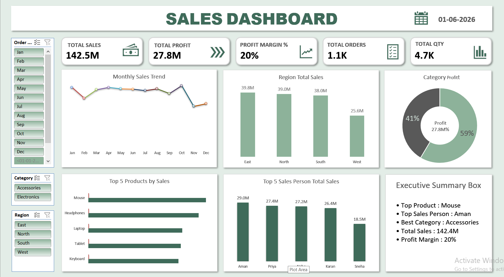

<div align="center">

# 📈 Sales Dashboard Project
### Excel Portfolio Project


*An interactive Sales Dashboard built in Microsoft Excel to analyze sales performance, profit, orders, and quantity sold.*

</div>

---

## 📌 Project Overview

This project analyzes sales transaction data to uncover performance trends across products, regions, and salespersons — turning raw numbers into a clean, interactive Excel dashboard for **data-driven business decisions**.

---

## 📌 KPIs Tracked

| KPI | Description |
|---|---|
| 💰 **Total Sales** | Overall revenue generated |
| 📈 **Total Profit** | Net profit across all sales |
| 📦 **Total Orders** | Number of orders placed |
| 🔢 **Total Quantity** | Units sold |

---

## ✨ Dashboard Features

- 📌 Dynamic KPI cards (Total Sales, Total Profit, Total Orders, Total Quantity)
- 🎛️ Interactive slicers
- 📅 Monthly sales trend analysis
- 🌍 Regional sales analysis
- 🏷️ Category-wise profit analysis
- 🧑‍💼 Salesperson performance analysis

---

## 🛠️ Tools Used

| Tool / Technique | Purpose |
|---|---|
| **Microsoft Excel** | Core platform |
| **Pivot Tables** | Data summarization |
| **Pivot Charts** | Visual trends |
| **Slicers** | Interactive filtering |
| **Conditional Formatting** | Visual highlighting |

---

## 🖼️ Dashboard Preview

<div align="center">



</div>

---

## 🔍 Key Insights

- 🏆 Identified top-performing products and salespersons
- 🌍 Analyzed regional sales performance
- 📅 Tracked monthly sales trends and profit contribution

---

## 📁 Repo Structure

```
├── Sales_Dashboard.xlsx     # Excel dashboard file
├── sales_dashboard.png      # Dashboard screenshot
└── README.md                # This file
```

---

## 👤 Author

**Shubham Dekate**
*Aspiring Data Analyst*

<div align="center">

⭐ *If you found this project useful, consider giving it a star!*

</div>
